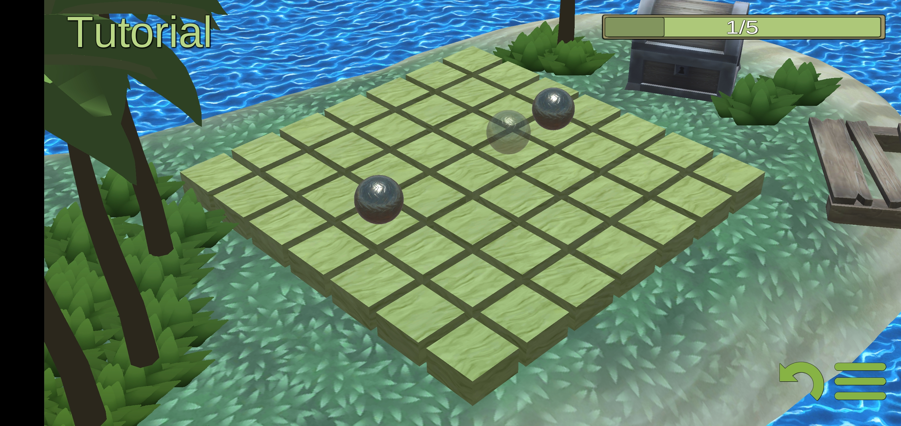
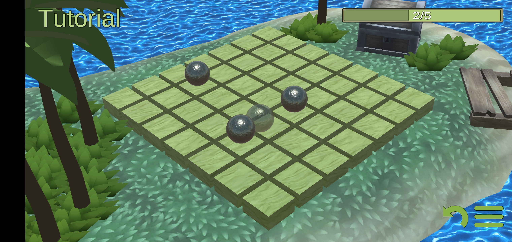
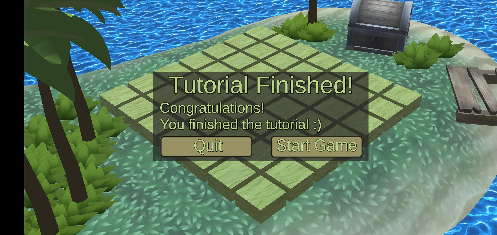
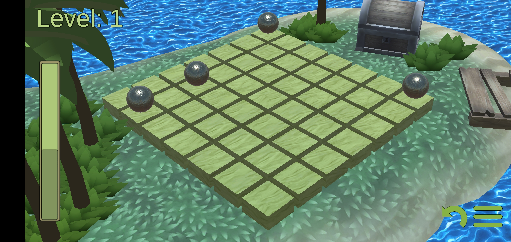

# Marbles

Unity game `Marbles` written for Mobile in C#. The game is heavily inspired by [Shot by gamedesign](https://www.gamedesign.jp/flash/shot/shot.html).

Download APK: [marbles.apk](marbles.apk)

The rules are:
1. Clear the board until only one marble remains on the board
2. Clear the board within the time limit. Solving the board increases the remaining time.
3. Make a gesture to move one marble, the marbles collide and one marble will drop of the board.
4. On a move, at least two marbles have to collide once
5. When two marbles are positioned next to each other, they can't hit each other.

The tutorial will guide you through these rules, they are quite intuitive once you get a feel for them.

